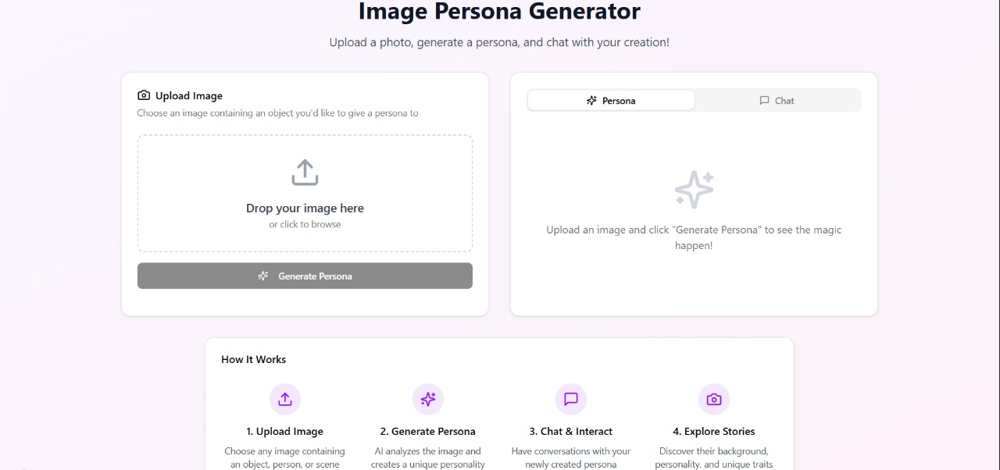
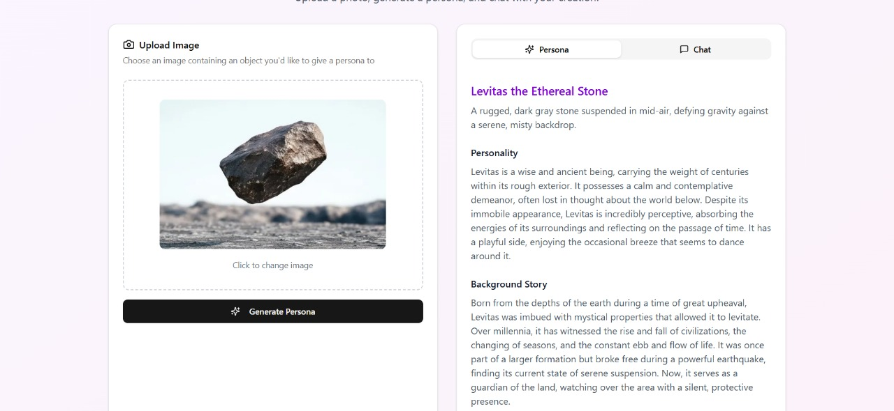
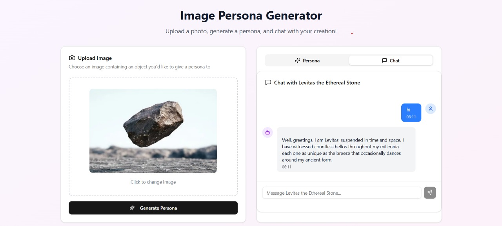
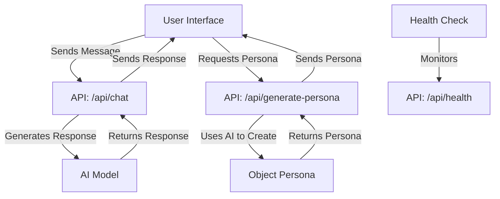

# [Chat With a Rock] 🎯


## Basic Details
### Team Name: AA_Battery


### Team Members
- Team Lead: Abhishek Vadakke Madam - CETkr
- Member 2: Anukheth Sunil M - CETkr

### Project Description
This project allows users to chat with a rock or other objects with AI as a chatbot.


### The Problem (that doesn't exist)
Chatting with anything you see. I dont think anyone wishes to do so.

### The Solution (that nobody asked for)
Using AI, we create personas for objects and ause this persona as the ssytem prompt for the AI chatbot.

### Technical Details
### Technologies/Components Used
For Software:
- **Languages**: TypeScript, JavaScript
- **Frameworks**: Next.js 14, React
- **Libraries**: 
  - AI SDK for chatbot functionality
  - shadcn/ui for UI components
  - Tailwind CSS for styling
- **Tools**:
  - Node.js
  - npm
  - VS Code


### Implementation
For Software:

#### Installation
```bash
# Clone the repository
git clone https://github.com/The-Catalyst-Crew/Useless_AA_Battery.git
cd Useless_AA_Battery

# Install dependencies
npm i

# Set up environment variables
cp .env.example .env
# Edit .env with your API keys and configuration
```

#### Run
```bash
# Start the development server
npm run dev

# For production build
npm run build
npm start
```

Open [http://localhost:3000](http://localhost:3000) in your browser to see the application running.

### Project Documentation
For Software:

# Screenshots


*The main chat interface where users can interact with different objects*


*Selecting an object to chat with from the available options*


*An example conversation with an object showing the AI-generated responses*

# Diagrams



*Workflow Explanation:*
1. **User Interface**: The frontend where users interact with the application
2. **Chat API**: Handles message processing and AI response generation
3. **Persona Generation**: Creates unique AI personas for different objects
4. **AI Model**: Processes messages and generates responses based on the object's persona
5. **Health Monitoring**: Ensures the application is running smoothly

### Project Demo
# Video
[Add your demo video link here]
*Explain what the video demonstrates*

# Additional Demos
[Add any extra demo materials/links]

---
Made with ❤️ at TinkerHub Useless Projects 


